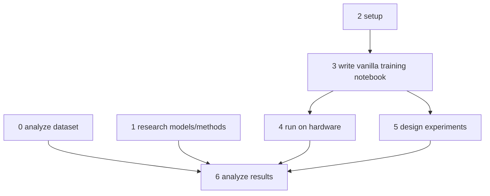

# TODO

## 2025-03-14

- [ ] 0. analyze dataset @sheena
- [ ] 1. research models/methods @pedro + @bruno
- [ ] 2. setup @zach
- [ ] 3. write vanilla training notebook @zach
- [ ] 4. run on hardware (small) @pedro + @zach
- [ ] 5. design experiments @pedro + @bruno
- [ ] 6. analyze results

- [ ] yolo @marti
- [ ] sota @marti
  - results format
  - dataset format
  - i/o is the same

## deadlines
- 2025-03-14 Wednesday EOD: ready for step 5