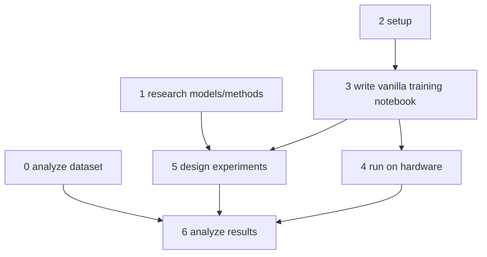

# TODO

## 2025-03-14

- [x] 0. analyze dataset @sheena
- [x] 1. research models/methods @pedro + @bruno
- [x] 2. setup @zach
- [x] 3. write vanilla training notebook @zach
- [x] 4. run on hardware (small) @pedro + @zach
- [ ] 5. design experiments @pedro + @bruno
- [ ] 6. analyze results

## 2025-03-25

- [ ] check dataset loading @sheena
- [ ] create system for picking best net @pedro
- [ ] setup augmentation and resolution experiments @bruno

- [ ] yolo @marti
    - match data and metrics to our outputs
- [ ] sota @marti
  - results format
  - dataset format
  - i/o is the same

## deadlines
- 2025-03-14 Wednesday EOD: ready for step 5
- 2025-03-26 Wednesday EOD: have pipeline ready for picking
- 2025-03-27 Thursday: have best net chosen
